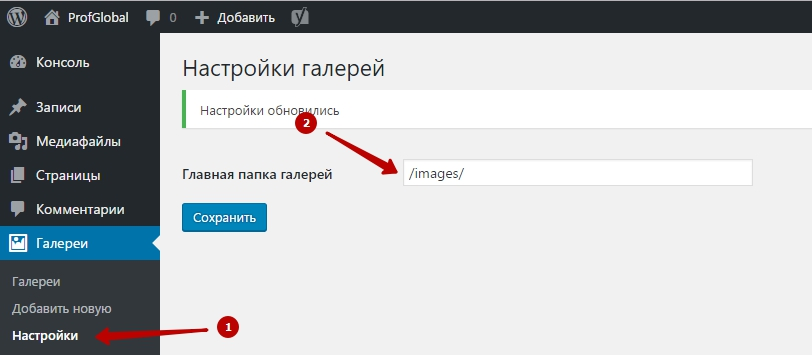
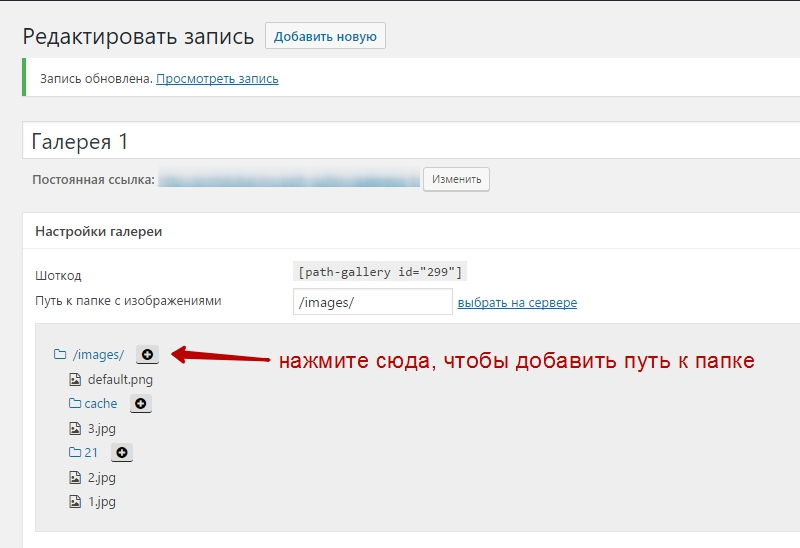

# Path Gallery - плагин позволяющий создать галерею изображений из любой папки сайта на Wordpress. 

***
## Используемые плагины, библиотеки
* Lightbox2
* jQuery
* Flexbox

## Инструкция
### 1.Подготовка
Для начала вам необходимо создать папку и выставить необходимые права на эту папку (755 можно и 777, но не рекомендуется в целях безопасности). Далее идём в настройки плагина и указываем папку в таком формате: /название_вашей_папки_с_галереями/.

### 2. Создание галереи

Перейдите в админку, а именно в раздел "Галереи" и выберите пункт "Добавить новую".
Создание галереи очень похоже как создание записи Wordpress. 

Выберите путь к галереи используя "выбрать на сервере". В случае если ваша папка вложена вы можете нажать на название папки чтобы получить подпапки. Нажатие на кнопку с "плюсиком" автоматически добавлет путь к галерее в тектовое поле.

__После добавления путей, не забудьте сохранить галерею, чтобы получить превью изображений вашей галереи!__

### Вставка в запись

В режиме редактирования галереи скопируйте шоткод галереи и вставьте в то место записи где нужно вывести вашу галерею.

Также шоткод может иметь дополнительные параметры:
* id - id созданной галереи изображений
* width  - ширина создаваемых миниатюр
* height - высота миниатюр
* margin_bottom - отступ в пикселях внизу, под картинкой

